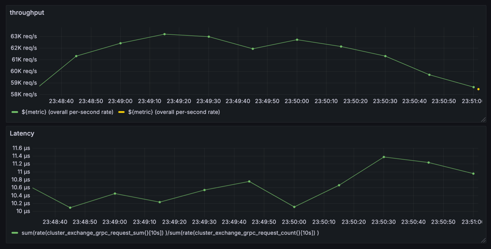

# Cafe Exchange

Note: This project is still under development.

## Overview

## Stacks
- [X] `Cafe ringbuffer`
- [X] `Agrona real-logic`

## Benchmark



## Quick start

- Setup dev

```shell
make setup-dev
```

- add `--add-opens java.base/java.nio=ALL-UNNAMED` to the JVM arguments

- Run cluster

```shell
make run-cluster PORT=8080 GRPC_PORT=9500
make run-cluster PORT=8081 GRPC_PORT=9500
make run-cluster PORT=8082 GRPC_PORT=9500
```

- Run client

```shell
./gradlew :exchange-client:run-client -Pport=8090
```

- Run benchmark

```shell
./gradlew :benchmark-cluster:run-benchmark -Pport=8095
```

Client Swagger: http://localhost:8090/swagger-ui/index.html

## Schema reference

- https://developers.binance.com/docs/derivatives/option/general-info

